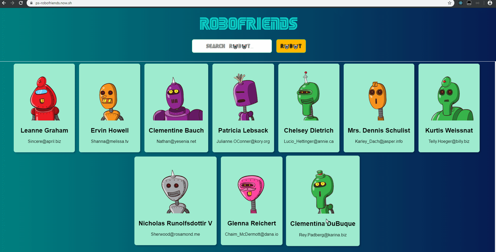

# Robot Friends

#### Finished Projects:

[R🤖B🤖FRIENDS](https://ps-robofriends.now.sh)



**What is the App Doing:**
> Search your robot friends

**Used Technologies:**
> HTML, CSS, JSX, REACTJS, VanillaJS

**This App Demonstrate:**
  * API Request
  * DOM Events
  * User Input
  * Component Based Architecture
    * Props
    * States
    * Life Cycle
    * Children

  >Robothash API
```js
https://robohash.org/
```
  >Jsonplaceholder API
```js
https://jsonplaceholder.typicode.com/users
```
